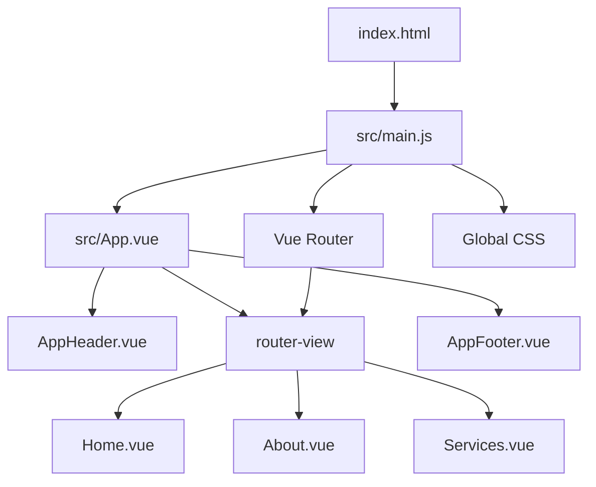

# CAAT Pension Vue.js Project - Developer Wiki

## 📋 Table of Contents

1. [Project Overview](#project-overview)
2. [Architecture & Structure](#architecture--structure)
3. [Component Documentation](#component-documentation)
4. [Development Guidelines](#development-guidelines)
5. [Styling & Design System](#styling--design-system)
6. [Testing Strategy](#testing-strategy)
7. [Build & Deployment](#build--deployment)
8. [Troubleshooting](#troubleshooting)
9. [Resources & References](#resources--references)

---

## 🎯 Project Overview

### Purpose
The CAAT Pension Vue.js project is a modern, responsive website that replicates the design and functionality of the CAAT Pension website. It serves as a professional financial services portal providing retirement security information and services for Canadians.

### Mission Statement
> "Our purpose is to improve retirement security for Canadians because we believe that every Canadian deserves to retire well."

### Technology Stack
- **Frontend Framework**: Vue 3 (Composition API ready)
- **Build Tool**: Vite 5.3.1
- **Routing**: Vue Router 4.4.0
- **Testing**: Vitest with Vue Test Utils
- **Styling**: CSS3 with custom properties (CSS variables)
- **Development Environment**: Node.js with npm

### Key Features
- 📱 **Responsive Design**: Mobile-first approach with professional styling
- 🧩 **Component-Based Architecture**: Modular, reusable Vue components
- ⚡ **Fast Development**: Hot Module Replacement (HMR) with Vite
- 🎨 **Professional UI**: Financial services-appropriate design system
- ♿ **Accessibility**: WCAG compliant design patterns
- 🧪 **Comprehensive Testing**: Unit tests with Vitest and Vue Test Utils

---

## 🏗️ Architecture & Structure

### Project Directory Structure

```
caat-pension-vue/
├── 📄 package.json              # Dependencies and scripts
├── 📄 vite.config.js            # Vite build configuration
├── 📄 index.html                # Entry HTML file
├── 📄 README.md                 # Project documentation
├── 📄 project_wiki.md          # This developer wiki
├── 📄 codebase-diagram.html    # Visual architecture diagram
├── 📁 src/                      # Source code
│   ├── 📄 main.js               # Application entry point
│   ├── 📄 App.vue              # Root Vue component
│   ├── 📄 style.css            # Global styles & CSS variables
│   └── 📁 components/          # Vue components
│       ├── 📄 AppHeader.vue    # Navigation header
│       ├── 📄 Home.vue         # Landing page
│       ├── 📄 About.vue        # About page
│       ├── 📄 Services.vue     # Services page
│       └── 📄 AppFooter.vue    # Site footer
├── 📁 tests/                   # Test files
│   ├── 📄 setup.js             # Test configuration
│   └── 📁 unit/components/     # Component unit tests
└── 📁 node_modules/            # Dependencies (auto-generated)
```

### Application Flow



### Component Hierarchy

```
App.vue (Root)
├── AppHeader.vue (Navigation)
├── <router-view> (Dynamic Content)
│   ├── Home.vue (Landing Page)
│   ├── About.vue (Company Info)
│   └── Services.vue (Service Details)
└── AppFooter.vue (Site Footer)
```

---

## 🧩 Component Documentation

### AppHeader.vue
**Purpose**: Main navigation component with responsive mobile menu

**Features**:
- CAAT branding and logo
- Responsive navigation menu
- Mobile hamburger menu with animations
- Vue Router integration
- Sticky header with shadow effect

**Data Properties**:
```javascript
data() {
  return {
    isMenuOpen: false  // Controls mobile menu visibility
  }
}
```

**Methods**:
- `toggleMenu()`: Toggle mobile menu open/closed
- `closeMenu()`: Close mobile menu (used on navigation)

**Responsive Behavior**:
- Desktop: Horizontal navigation bar
- Mobile (< 768px): Hamburger menu with slide-down overlay

---

### Home.vue
**Purpose**: Main landing page showcasing CAAT's mission and services

**Sections**:
1. **Hero Section**: Main banner with purpose statement and CTAs
2. **CEO Message**: Leadership quote with placeholder image
3. **What's New**: News grid with latest updates (3 articles)
4. **Services Overview**: Service cards with icons and descriptions
5. **Quick Access**: Member and employer portal links

**Key Features**:
- Grid-based responsive layouts
- Hover effects on cards
- Professional imagery placeholders
- Call-to-action buttons

---

### About.vue
**Purpose**: Company information, mission, values, and history

**Sections**:
1. **Hero Section**: About page introduction
2. **Mission Statement**: Company purpose and vision
3. **Core Values**: Four value cards (Excellence, Integrity, Innovation, Security)
4. **Leadership Team**: Leadership profiles with placeholder images
5. **Company History**: Timeline of major milestones
6. **Statistics**: Key metrics (members, assets, employers, years)

**Design Elements**:
- Timeline with date markers
- Statistics with gradient background
- Leadership cards with professional styling
- Mission/vision grid layout

---

### Services.vue
**Purpose**: Comprehensive overview of pension services and solutions

**Sections**:
1. **Hero Section**: Services introduction
2. **Services Overview**: Descriptive content
3. **Main Services Grid**: Six primary service cards
4. **Service Categories**: Member, Employer, and Retiree focused services
5. **Process Flow**: 4-step service process visualization
6. **Service Standards**: Quality commitment cards
7. **Contact CTA**: Call-to-action for engagement

**Features**:
- Featured service highlighting
- Interactive process flow with arrows
- Service features lists with checkmarks
- Category-specific resource links

---

### AppFooter.vue
**Purpose**: Site footer with comprehensive links and information

**Sections**:
1. **Company Information**: CAAT description with social media
2. **Quick Links**: Main site navigation
3. **Member Resources**: Member-specific links
4. **Employer Resources**: Employer-focused links
5. **Contact Information**: Phone, email, and address
6. **Footer Bottom**: Copyright and legal links

**Features**:
- Responsive grid layout
- Social media link styling
- Contact information formatting
- Legal compliance links

---

### App.vue
**Purpose**: Root application component that provides layout structure

**Structure**:
```vue
<template>
  <div id="app">
    <AppHeader />      <!-- Always visible navigation -->
    <router-view />    <!-- Dynamic page content -->
    <AppFooter />      <!-- Always visible footer -->
  </div>
</template>
```

**Styling**:
- Flexbox layout with `min-height: 100vh`
- `flex-direction: column` for proper footer positioning
- Footer automatically sticks to bottom via `margin-top: auto`

---

## 👨‍💻 Development Guidelines

### 🚀 Getting Started

#### Prerequisites
```bash
# Required software
Node.js >= 18.0.0
npm >= 8.0.0

# Verify installation
node --version
npm --version
```

#### Initial Setup
```bash
# 1. Clone or download the project
# 2. Navigate to project directory
cd caat-pension-vue

# 3. Install dependencies
npm install

# 4. Start development server
npm run dev

# 5. Open browser to http://localhost:5173
```

#### Available Scripts
```bash
# Development
npm run dev          # Start dev server with HMR
npm run build        # Build for production
npm run preview      # Preview production build

# Testing
npm run test         # Run unit tests
npm run test:ui      # Run tests with UI
npm run test:coverage # Run tests with coverage report
```

### 📝 Coding Standards

#### Vue Component Structure
```vue
<template>
  <!-- HTML template with semantic structure -->
  <main class="component-name">
    <section class="section-name">
      <!-- Content -->
    </section>
  </main>
</template>

<script>
export default {
  name: 'ComponentName',  // Always include component name
  data() {
    return {
      // Component state
    }
  },
  methods: {
    // Component methods
  }
}
</script>

<style scoped>
/* Scoped styles using CSS custom properties */
.component-name {
  /* Component-specific styles */
}
</style>
```

#### JavaScript Guidelines
- Use ES6+ features (const/let, arrow functions, destructuring)
- Follow Vue.js style guide conventions
- Use descriptive variable and function names
- Include comments for complex logic

#### HTML/Template Guidelines
- Use semantic HTML elements (`<main>`, `<section>`, `<nav>`, `<header>`, `<footer>`)
- Include proper ARIA attributes for accessibility
- Use kebab-case for custom attributes and classes
- Maintain proper indentation (2 spaces)

#### CSS Guidelines
- Use CSS custom properties (variables) for theming
- Follow mobile-first responsive design
- Use scoped styles in components
- Maintain consistent naming conventions
- Include hover states and transitions

### 🔄 Development Workflow

#### 1. Feature Development
```bash
# 1. Start development server
npm run dev

# 2. Make changes to components
# 3. View changes at http://localhost:5173
# 4. Test responsive design using browser dev tools
```

#### 2. Adding New Components
```bash
# 1. Create new .vue file in src/components/
# 2. Import in main.js or parent component
# 3. Add to router if it's a page component
# 4. Create corresponding test file
```

#### 3. Adding New Routes
```javascript
// In src/main.js, add to routes array:
const routes = [
  { path: '/', component: Home },
  { path: '/about', component: About },
  { path: '/services', component: Services },
  { path: '/new-page', component: NewPage }, // Add here
]
```

#### 4. Testing Changes
```bash
# Run unit tests
npm run test

# Run specific test file
npm run test AppHeader.test.js

# Run tests with coverage
npm run test:coverage
```

### 🎨 Component Development Best Practices

#### Responsive Design
```css
/* Mobile-first approach */
.component {
  /* Mobile styles (default) */
  font-size: 1rem;
}

@media (min-width: 768px) {
  .component {
    /* Tablet/Desktop styles */
    font-size: 1.2rem;
  }
}
```

#### CSS Custom Properties Usage
```css
.component {
  color: var(--primary-blue);
  background-color: var(--white);
  border: 2px solid var(--gray-light);
}
```

#### Vue Router Integration
```vue
<template>
  <!-- Use router-link for internal navigation -->
  <router-link to="/about" class="btn btn-primary">
    Learn More
  </router-link>
  
  <!-- Use regular <a> for external links -->
  <a href="https://external-site.com" target="_blank">
    External Link
  </a>
</template>
```

#### State Management
```javascript
// For simple state, use component data
data() {
  return {
    isMenuOpen: false,
    currentTab: 'overview'
  }
}

// For complex state, consider Vue composition API or Pinia
```

---

## 🎨 Styling & Design System

### Color Palette

```css
:root {
  /* Primary Colors */
  --primary-blue: #004d9f;      /* Main brand color */
  --secondary-blue: #0066cc;     /* Secondary actions */
  --light-blue: #e6f2ff;        /* Backgrounds */
  --dark-blue: #003366;         /* Footer, dark sections */
  
  /* Accent Colors */
  --green-accent: #00a86b;      /* CTAs, highlights */
  
  /* Neutral Colors */
  --white: #ffffff;
  --gray-light: #f5f5f5;       /* Light backgrounds */
  --gray-medium: #cccccc;       /* Borders, placeholders */
  --gray-dark: #666666;        /* Secondary text */
  --text-dark: #333333;        /* Primary text */
}
```

### Typography Scale

```css
/* Font Sizes */
h1: 3rem (48px) → 2.2rem (35px) mobile
h2: 2.5rem (40px) → 2rem (32px) mobile
h3: 2rem (32px) → 1.5rem (24px) mobile
h4: 1.5rem (24px) → 1.3rem (21px) mobile
body: 1rem (16px)
small: 0.9rem (14px)
```

### Component Styling Patterns

#### Cards
```css
.card {
  background-color: var(--white);
  padding: 2rem;
  border-radius: 10px;
  box-shadow: 0 4px 15px rgba(0, 0, 0, 0.1);
  transition: transform 0.3s ease;
}

.card:hover {
  transform: translateY(-5px);
}
```

#### Buttons
```css
.btn {
  padding: 0.75rem 1.5rem;
  border-radius: 5px;
  font-weight: 600;
  text-decoration: none;
  transition: all 0.3s ease;
  display: inline-block;
  border: none;
  cursor: pointer;
}

.btn-primary {
  background-color: var(--primary-blue);
  color: var(--white);
}

.btn-secondary {
  background-color: var(--green-accent);
  color: var(--white);
}
```

#### Grid Layouts
```css
.grid-responsive {
  display: grid;
  grid-template-columns: repeat(auto-fit, minmax(300px, 1fr));
  gap: 2rem;
}
```

### Responsive Breakpoints

```css
/* Mobile First Approach */
/* Base styles: Mobile (< 768px) */

@media (min-width: 768px) {
  /* Tablet and Desktop styles */
}

@media (max-width: 480px) {
  /* Extra small mobile adjustments */
}
```

---

## 🧪 Testing Strategy

### Testing Framework Setup

The project uses **Vitest** with **Vue Test Utils** for comprehensive unit testing:

```javascript
// Test configuration in vite.config.js
export default defineConfig({
  plugins: [vue()],
  test: {
    globals: true,
    environment: 'jsdom'
  }
})
```

### Test File Structure

```
tests/
├── setup.js                    # Test configuration
└── unit/components/
    ├── App.test.js             # Root component tests
    ├── AppHeader.test.js       # Navigation tests
    ├── Home.test.js            # Home page tests
    ├── About.test.js           # About page tests
    ├── Services.test.js        # Services page tests
    └── AppFooter.test.js       # Footer tests
```

### Testing Patterns

#### Basic Component Test
```javascript
import { describe, it, expect } from 'vitest'
import { mount } from '@vue/test-utils'
import ComponentName from '../../../src/components/ComponentName.vue'

describe('ComponentName.vue', () => {
  it('renders correctly', () => {
    const wrapper = mount(ComponentName)
    expect(wrapper.exists()).toBe(true)
  })
})
```

#### Testing with Vue Router
```javascript
import { createRouter, createWebHistory } from 'vue-router'

const router = createRouter({
  history: createWebHistory(),
  routes: [
    { path: '/', component: Home },
    { path: '/about', component: About }
  ]
})

const wrapper = mount(Component, {
  global: {
    plugins: [router]
  }
})
```

#### Testing User Interactions
```javascript
it('toggles mobile menu on click', async () => {
  const wrapper = mount(AppHeader)
  const toggleButton = wrapper.find('.mobile-menu-toggle')
  
  await toggleButton.trigger('click')
  expect(wrapper.vm.isMenuOpen).toBe(true)
})
```

### Test Coverage Goals

- **Components**: 90%+ coverage for all Vue components
- **User Interactions**: Test all click handlers and form submissions
- **Navigation**: Verify all router links work correctly
- **Responsive Behavior**: Test mobile menu and responsive layouts
- **Accessibility**: Verify ARIA attributes and semantic structure

### Running Tests

```bash
# Run all tests
npm run test

# Run tests in watch mode
npm run test -- --watch

# Run tests with coverage
npm run test:coverage

# Run specific test file
npm run test AppHeader.test.js

# Run tests with UI interface
npm run test:ui
```

---

## 🚀 Build & Deployment

### Development Build

```bash
# Start development server
npm run dev

# Features:
# - Hot Module Replacement (HMR)
# - Source maps for debugging
# - Fast compilation with Vite
# - Automatic browser refresh
```

### Production Build

```bash
# Build for production
npm run build

# Output directory: dist/
# - Minified and optimized code
# - Tree-shaken dependencies
# - Optimized assets
# - Gzipped files for better performance
```

### Build Configuration

The project uses Vite for building with the following optimizations:

```javascript
// vite.config.js
export default defineConfig({
  plugins: [vue()],
  build: {
    // Automatic optimizations:
    // - Code splitting
    // - Tree shaking
    // - Minification
    // - Asset optimization
  }
})
```

### Deployment Options

#### 1. Static Site Hosting
```bash
# Build project
npm run build

# Deploy dist/ folder to:
# - Netlify
# - Vercel
# - GitHub Pages
# - AWS S3 + CloudFront
```

#### 2. Server Deployment
```bash
# For server deployment, ensure:
# - Node.js environment
# - Serve static files from dist/
# - Configure routing for SPA
```

#### 3. Docker Deployment
```dockerfile
# Dockerfile example
FROM node:18-alpine
WORKDIR /app
COPY package*.json ./
RUN npm ci --only=production
COPY dist/ ./dist/
EXPOSE 3000
CMD ["npx", "serve", "-s", "dist", "-l", "3000"]
```

---

## 🔧 Troubleshooting

### Common Issues

#### 1. Development Server Won't Start
```bash
# Solution 1: Clear node_modules and reinstall
rm -rf node_modules package-lock.json
npm install

# Solution 2: Check Node.js version
node --version  # Should be 18+

# Solution 3: Check port availability
lsof -i :5173  # Check if port is in use
```

#### 2. Tests Not Running
```bash
# Check test dependencies
npm list vitest @vue/test-utils jsdom

# Reinstall test dependencies
npm install --save-dev vitest @vue/test-utils jsdom

# Run tests with verbose output
npm run test -- --reporter=verbose
```

#### 3. CSS Styles Not Loading
```bash
# Check import path in main.js
import './style.css'

# Verify CSS custom properties are defined
# Check browser dev tools for CSS errors
```

#### 4. Router Navigation Issues
```bash
# Check router configuration in main.js
# Verify component imports
# Check Vue Router documentation for updates
```

#### 5. Build Errors
```bash
# Clear Vite cache
rm -rf node_modules/.vite

# Check for TypeScript errors (if using TypeScript)
# Verify all imports and dependencies
```

### Performance Optimization

#### 1. Bundle Size Analysis
```bash
# Build with bundle analyzer
npm run build -- --analyze

# Check for large dependencies
npm list --depth=0
```

#### 2. Lazy Loading Components
```javascript
// For large components, use dynamic imports
const LargeComponent = () => import('./components/LargeComponent.vue')
```

#### 3. Image Optimization
- Use appropriate image formats (WebP, AVIF)
- Implement responsive images
- Consider image lazy loading

### Browser Compatibility

#### Supported Browsers
- Chrome 80+
- Firefox 75+
- Safari 13+
- Edge 80+

#### Polyfills (if needed)
```bash
# For older browser support
npm install --save core-js
```

---

## 📚 Resources & References

### Official Documentation
- [Vue.js 3 Documentation](https://vuejs.org/)
- [Vue Router Documentation](https://router.vuejs.org/)
- [Vite Documentation](https://vitejs.dev/)
- [Vitest Documentation](https://vitest.dev/)
- [Vue Test Utils](https://vue-test-utils.vuejs.org/)

### Design Resources
- [CSS Custom Properties (MDN)](https://developer.mozilla.org/en-US/docs/Web/CSS/Using_CSS_custom_properties)
- [Responsive Web Design Patterns](https://web.dev/responsive-web-design-basics/)
- [Accessibility Guidelines (WCAG)](https://www.w3.org/WAI/WCAG21/quickref/)

### Development Tools
- [Vue DevTools](https://devtools.vuejs.org/) - Browser extension for Vue debugging
- [VS Code Vue Extension](https://marketplace.visualstudio.com/items?itemName=Vue.volar) - Volar for Vue 3
- [Prettier](https://prettier.io/) - Code formatting
- [ESLint](https://eslint.org/) - Code linting

### Project-Specific Resources
- `codebase-diagram.html` - Visual architecture overview
- `README.md` - Quick start guide
- Original CAAT Pension website: https://www.caatpension.ca

### Learning Resources
- [Vue.js Official Tutorial](https://vuejs.org/tutorial/)
- [Vue.js Style Guide](https://vuejs.org/style-guide/)
- [Modern CSS Layout](https://web.dev/learn/css/layout/)
- [JavaScript ES6+ Features](https://developer.mozilla.org/en-US/docs/Web/JavaScript)

---

## 📋 Project Checklist

### ✅ Completed Features
- [x] Vue 3 + Vite setup
- [x] Responsive navigation with mobile menu
- [x] Home page with hero, services, and news sections
- [x] About page with mission, values, and history
- [x] Services page with comprehensive offerings
- [x] Professional footer with all sections
- [x] CSS design system with custom properties
- [x] Vue Router integration
- [x] Unit testing framework setup
- [x] Comprehensive test suite
- [x] Documentation and wiki

### 🚧 Potential Enhancements
- [ ] Contact form functionality
- [ ] Member/Employer login portals
- [ ] Content Management System integration
- [ ] Search functionality
- [ ] Multi-language support (English/French)
- [ ] Progressive Web App (PWA) features
- [ ] Advanced animations and micro-interactions
- [ ] SEO optimization and meta tags
- [ ] Analytics integration
- [ ] Performance monitoring

---

**Last Updated**: December 2024  
**Project Version**: 1.0.0  
**Maintainer**: Development Team

---

*This wiki is a living document. Please keep it updated as the project evolves.*
